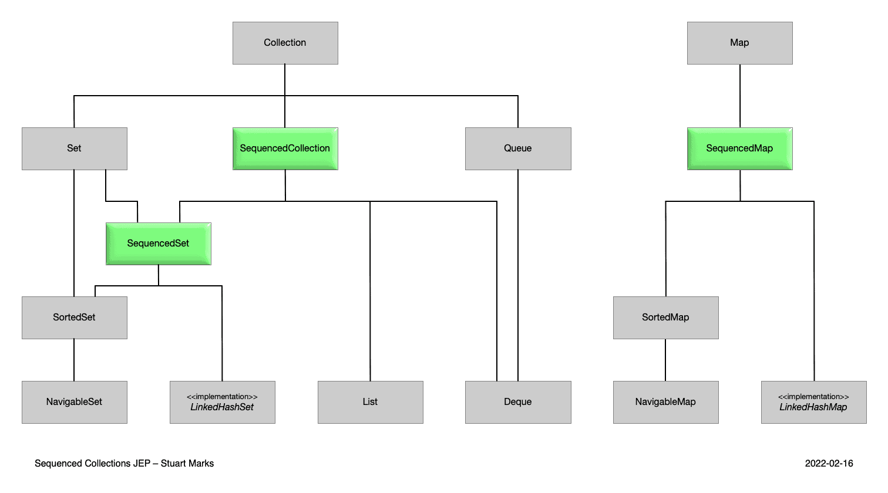

# Java újdonságok

## Bevezetés

Ha a Java nyelv újdonságait követjük, gyakran találkozunk a Data-Oriented programming kifejezéssel.
Mi is ez, és miért mutatnak az új nyelvi elemek ebbe az irányba, úgymint a Java record, sealed types, switch pattern matching, stb.
Mennyire illik ez bele az objektumorientált gondolkodásba?

## Java 16 - ismétlés

## Records

* Immutable osztályokhoz
* `final` attribútumok
* konstruktor, getterek, `equals`, `hashCode` és `toString` metódusok
  * Fejlesztőeszközzel generálva
  * Lombok (`@Value` annotáció)


```java
public record Interval(LocalDateTime start, LocalDateTime end) {
}
```

```java
var start = LocalDateTime.parse("2022-01-01T10:30");
var end = LocalDateTime.parse("2022-01-01T11:00");
var interval = new Interval(start, end);
System.out.println(interval.start());
```

---

## Tulajdonságai

* Őse: `java.lang.Record`
* IDEA támogatás: Class can be a record
* Bővíthető új metódussal

```java
public record Interval(LocalDateTime start, LocalDateTime end) {

  public Duration length() {
      return Duration.between(start, end);
  }
}
```

* Implementálhat interfészt

---

## Konstruktorok

```java
public Interval(LocalDateTime start, LocalDateTime end) {
    if (start == null) {
        throw new IllegalArgumentException("No start");
    }
    this.start = start;
    this.end = end;
}
```

* Compact form

```java
public Interval {
    if (start == null) {
        throw new IllegalArgumentException("No start");
    }
}
```

---

## Konstruktor overload

```java
public Interval(LocalDateTime start) {
    this(start, null);
}
```

## Record használata Spring Boot alkalmazásban

* Spring Boot project
* Spring Data JDBC, PostgreSQL, Testcontainers, Spring Web
* https://docs.spring.io/spring-data/relational/reference/object-mapping.html#mapping.general-recommendations
    * _Try to stick to immutable objects_
* `schema.sql`

```sql
create table employee (id int8 generated by default as identity,
                        name varchar(255), primary key (id));
insert into employee(name) values ('John Doe');
insert into employee(name) values ('Jack Doe');
```

## Java 17 - ismétlés

## Sealed types

* Szigorúbb vezérlés, hogy ki származhat le egy osztálytól, vagy ki implementálhatja az interfészt
* API fejlesztőknek

```java
public sealed interface HasName permits Employee, Consumer {
        // ...
}

public non-sealed class Employee implements HasName {
        // ...
}

public final class Consumer implements HasName {
        // ...
}
```

## Sealed classes in JDK

```java
abstract sealed class AbstractStringBuilder implements Appendable, CharSequence
    permits StringBuilder, StringBuffer {
        // ...
}

public final class StringBuilder
    extends AbstractStringBuilder
    implements java.io.Serializable, Comparable<StringBuilder>, CharSequence {
        // ...
}
```

## Java 18 újdonságok

* JEP 400: UTF-8 by Default
* JEP 408: Simple Web Server
* JEP 413: Code Snippets in Java API Documentation
* JEP 416: Reimplement Core Reflection with Method Handles
* JEP 418: Internet-Address Resolution SPI
* JEP 421: Deprecate Finalization for Removal

## Java 18 Preview, Incubator

* JEP 417: Vector API (Third Incubator)
* JEP 419: Foreign Function & Memory API (Second Incubator) - Java 22-ben végleges
* JEP 420: Pattern Matching for switch (Second Preview) - Java 21-ben végleges

## `SimpleFileServer`

```java
var server = SimpleFileServer.createFileServer(new InetSocketAddress(8080),
        Path.of("").toAbsolutePath(),
        SimpleFileServer.OutputLevel.INFO);
server.start();
```

## `HttpServer`

```java
try {
    var server = HttpServer.create(new InetSocketAddress("localhost", 8080), 10);
    server.createContext("/hello",
            exchange -> {
                String body = "Hello %s".formatted(LocalDateTime.now());
                exchange.sendResponseHeaders(200, body.length());
                try (var response = new BufferedWriter(new OutputStreamWriter(exchange.getResponseBody()))) {
                    response.write(body);
    }}
            );
    server.start();
}
catch (IOException e) {
    e.printStackTrace();
}
```

## Java 19 újdonságok

JEP 422: Linux/RISC-V Port

## Java 19 Preview, Incubator

* JEP 405: Record Patterns (Preview) - Java 21-ben végleges
* JEP 424: Foreign Function & Memory API (Preview) - Java 22-ben végleges
* JEP 425: Virtual Threads (Preview) - Java 21-ben végleges
* JEP 426: Vector API (Fourth Incubator)
* JEP 427: Pattern Matching for switch (Third Preview) - Java 21-ben végleges
* JEP 428: Structured Concurrency (Incubator)

## Java 19 API változások

* `Locale` konstruktorok deprecatedek lettek, helyette `of()` gyártó metódusok
* `Objects.toIdentityString()` metódus

## API változtatások

```java
var locale = Locale.of("hu", "HU");
```

```java
System.out.println(Objects.toIdentityString("hello"));
```

## Java 20 újdonságok

## Java 20 Preview, Incubator

* JEP 429: Scoped Values (Incubator)
* JEP 432: Record Patterns (Second Preview) - Java 21-ben végleges
* JEP 433: Pattern Matching for switch (Fourth Preview) - Java 21-ben végleges
* JEP 434: Foreign Function & Memory API (Second Preview) - Java 22-ben végleges
* JEP 436: Virtual Threads (Second Preview) - Java 21-ben végleges
* JEP 437: Structured Concurrency (Second Incubator)
* JEP 438: Vector API (Fifth Incubator)

## Java 21 újdonságok

* JEP 431: Sequenced Collections
* JEP 439: Generational ZGC
* JEP 440: Record Patterns
* JEP 441: Pattern Matching for switch
* JEP 444: Virtual Threads
* JEP 449: Deprecate the Windows 32-bit x86 Port for Removal
* JEP 451: Prepare to Disallow the Dynamic Loading of Agents
* JEP 452: Key Encapsulation Mechanism API

## Sequenced Collections



```java
interface SequencedCollection<E> extends Collection<E> {

    // new method
    SequencedCollection<E> reversed();

    // methods promoted from Deque
    void addFirst(E);
    void addLast(E);

    E getFirst();
    E getLast();

    E removeFirst();
    E removeLast();
}
```

## Record Patterns

```java
record Point(double x, double y) {}
```

```java
if (obj instanceof Point(double x, double y)) {
    System.out.println(Math.toDegrees(Math.atan2(y, x)));
}
```

## Record Patterns - Generic records 

```java
record Box<T>(T t) { }
```

```java
if (bo instanceof Box<String>(String s)) {
    System.out.println("Box contains: " + s);
}
```

## Record Patterns - Type Inference

```java
record Point(double x, double y) {}
```

```java
if (obj instanceof Point(var x, var y)) {
    System.out.println(Math.toDegrees(Math.atan2(y, x)));
}
```

## Record Patterns - Nested Record Patterns

```java
record Point(double x, double y) {}
enum Color { RED, GREEN, BLUE }
record ColoredPoint(Point p, Color c) {}
record ColoredRectangle(ColoredPoint upperLeft, ColoredPoint lowerRight) {}   
```

```java
if (r instanceof ColoredRectangle(
    ColoredPoint(Point(var x, var y), var upperLeftColor),
                    var lowerRightCorner)) {
    System.out.println("Upper-left corner: " + x);
}
```

## Pattern Matching for switch

```java
interface Shape { }
record Rectangle(double length, double width) implements Shape { }
record Circle(double radius) implements Shape { }
```

```java
public static double getPerimeter(Shape shape) throws IllegalArgumentException {
    return switch (shape) {
        case Rectangle r -> 2 * r.length() + 2 * r.width();
        case Circle c    -> 2 * c.radius() * Math.PI;
        default          -> throw new IllegalArgumentException("Unrecognized shape");
    };
}
```

## Null values és Guarded Pattern

```java
private static String format(Object o) {
    return switch (o) {
        case String s when (s.length() > 5) -> s.substring(0, 5) + "...";
        case String s -> s;
        case null -> "empty";
        default -> o.toString();
    };
}
```

## Type coverage

```java
sealed interface Shape { }
record Rectangle(double length, double width) implements Shape { }
record Circle(double radius) implements Shape { }
```

// NEM FORDUL LE

```java
public static double getPerimeter(Shape shape) throws IllegalArgumentException {
    return switch (shape) {
        case Rectangle r -> 2 * r.length() + 2 * r.width();
        case Circle c    -> 2 * c.radius() * Math.PI;
    };
}
```

## Type coverage - megoldás

* Vagy `default` ág
* Vagy sealed classes

```java
sealed interface Shape permits Rectangle, Circle { }
record Rectangle(double length, double width) implements Shape { }
record Circle(double radius) implements Shape { }
```

Egy osztályon belül nem is kell a `permits`

## `case` ágak sorrendje

* Specifikusabb osztály kell előrébb

## Java 21 Preview, Incubator

* JEP 430: String Templates (Preview)
* JEP 442: Foreign Function & Memory API (Third Preview) - Java 22-ben végleges
* JEP 443: Unnamed Patterns and Variables (Preview) - Java 22-ben végleges
* JEP 445: Unnamed Classes and Instance Main Methods (Preview)
* JEP 446: Scoped Values (Preview)
* JEP 448: Vector API (Sixth Incubator)
* JEP 453: Structured Concurrency (Preview)

## Java 22 újdonságok

* JEP 423: Region Pinning for G1
* JEP 454: Foreign Function & Memory API
* JEP 456: Unnamed Variables & Patterns
* JEP 458: Launch Multi-File Source-Code Programs

## Java 22 Preview, Incubator

* JEP 447: Statements before super(...) (Preview)
* JEP 457: Class-File API (Preview)
* JEP 459: String Templates (Second Preview)
* JEP 460: Vector API (Seventh Incubator)
* JEP 461: Stream Gatherers (Preview)
* JEP 462: Structured Concurrency (Second Preview)
* JEP 463: Implicitly Declared Classes and Instance Main Methods (Second Preview)
* JEP 464: Scoped Values (Second Preview)

## Java 22 API változtatások

* `ListFormat`

## `ListFormat`

```java
var listFormat = ListFormat.getInstance(Locale.of("hu", "HU"), 
        ListFormat.Type.STANDARD, ListFormat.Style.FULL);
var colors = List.of("piros", "fehér", "zöld");
```

## Unnamed Variables & Patterns

* Nem a teljes objektumon dolgozunk, csak annak egy részén

Ciklusban:

```java
for (var _ : cars) {
    total++;
}
```

Értékadásban:

```java
var _ = update(command);
```

`catch` ágban:

```java
try {
    // ...
} catch (IllegalStateException _) {
    System.out.println("Got an illegal state exception");
} catch (RuntimeException _) {
    System.out.println("Got a runtime exception!");
}
```

Try-With Resources:

```java
try (var _ = new Transaction()) {
    updateCar(car);
}
```

```java
List.of("piros", "fehér", "zöld").forEach(_ -> System.out.println("color"));
```

## Data-Oriented Programming

* [Yehonathan Sharvit: Data-Oriented Programming: Reduce software complexity](https://www.amazon.com/Data-Oriented-Programming-Unlearning-Yehonathan-Sharvit/dp/1617298573) - 
* [Brian Goetz: Data Oriented Programming in Java](https://www.infoq.com/articles/data-oriented-programming-java/)
    * Java Language Architect
    * Specification lead for JSR-335 (Lambda Expressions for the Java Programming Language)
    * Java Concurrency in Practice írója
* [Nicolai Parlog: Data-Oriented Programming in Java - Version 1.1](https://inside.java/2024/05/23/dop-v1-1-introduction/)
* [Josh Long: Spring Tips: Data Oriented Programming in Java 21+](https://www.youtube.com/watch?v=K8na2qdHDuI)

## Data-Oriented Programming

* OOP gyakran komplex lesz
    * Többféle kapcsolat: association, aggregation, inheritance, use
    * Leszármazási hierarchia
    * Nehezen megérthető és módosítható
    * Serialization
    * Threading
* Új programozási paradigma: Data-Oriented Programming
* Alapelvek:
    * Principle #1 - Separate code from data
    * Principle #2 - Represent data entities with generic data structures
    * Principle #3 - Data is immutable
* OOP és FP között helyezkedik el, mindkettővel kompatibilis, FP-hez közelebb áll

## Principle #1 - Separate code from data

* Kód
    * Függvények
    * Állapotmentes
    * Mindent paraméterbe kapjon
    * Mellékhatásmentes
    * Nincs öröklődés
    * Csak hívás
* Adat
    * Csak adat

## Principle #2 - Represent data entities with generic data structures

* "Stringly typed"

```javascript
const employees [
    {
      "name": "John Doe",
      "position": "Software Engineer",
      "address": {
        "street": "123 Maple Street",
        "city": "Springfield",
        "state": "IL",
        "postalCode": "62704",
        "country": "USA"
      }
    },
    {
      "name": "Jane Smith",
      "position": "Project Manager",
      "address": {
        "street": "456 Oak Avenue",
        "city": "Metropolis",
        "state": "NY",
        "postalCode": "10001",
        "country": "USA"
      }
    }
  ];
```

```java
var employees = List.of(
                Map.of("name", "John Doe", "address",
                        Map.of("street", "123 Maple Street", "city", "Springfield")),
                Map.of("name", "Jane Smith", "address",
                        Map.of("street", "456 Oak Avenue", "city", "Metropolis"))
        );
```

Függőségek: id-k használatával

Flexibilitás ellentmond a típusossággal és biztonsággal. Változtatható, hogy mely mezők kerüljenek bele.

Generic data functions. Information path.

Java API: [Underscore-java](https://javadev.github.io/underscore-java/)

## Principle #3 - Data is immutable

* Mellékhatás elkerülése
* Párhuzamossági problémák elkerülése
* Generic data functions is immutable adatokkal dolgozzon. [Paguro](https://github.com/GlenKPeterson/Paguro)
    * Saját adattípusokkal dolgozik, hiszen a Java adattípusai nem ilyenek
    * Closure-é igen.
* Multi version state
    * Calculation phase
    * Commit phase
* Nincs performancia probléma.
* Structural sharing - mivel immutable, ágakat megoszthatnak egymás között.

## Brian Goetz

* Új nyelvi elemek:
    * Records
    * Sealed types
    * Record patterns
    * Pattern matching for switch
    * Unnamed Variables & Patterns
* Külön-külön is erősek, de egyben még erősebbek
* OOP: nagyon erős a boundary-k kialakításában
    * Monolit alkalmazásoknál erre nagy szükség is van
    * Microservice-ek esetén már nincs rá ekkora szükség
* Építőelemei:
    * Record - data
    * Sealed types - choices
    * Record + sealed types - nem ábrázolható érvénytelen állapot
    * Pattern matching for switch - working on polimorphic data

```java
public sealed interface Option<T> {

    record EmptyOption() implements Option {}

    record ValueOption<T>(T value) implements Option<T> {}
}
```

```java
Option<Object> option = new Option.ValueOption(new Employee(1L, "John Doe"));

var text = switch (option) {
    case Option.EmptyOption _ -> "[empty]";
    case Option.ValueOption(var value) -> value;
};
System.out.println(text);
```

## Összefoglalva

* OOP, DOP és FP megfér egymás mellett
* DOP - használjuk, ahol megfelelő
    * Egyszerű data oriented service-ek esetén
    * Adatfeldolgozás
    * Batch folyamatok
    * Data analysis
    * Event processing
    * Megfelelő rétegben, pl. DTO, integrációs
    * Ne komplex üzleti logika esetén